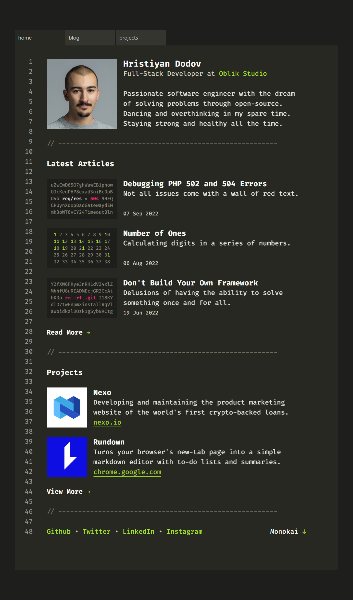
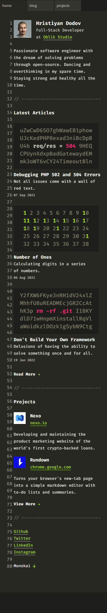

# dodov.dev Clone Project

> A simple clone of the personal website of Hristiyan Dodov, a full-stack developer at [Oblik Studio](https://oblik.studio/).

## Features

-   A home page
-   A blog page with six articles.
-   The six individual article pages
-   A project page with four projects worked.
-   The four indvidual project pages
-   Six color themes with six different favicons
-   A line counter
-   Customized scroll bars
-   Customized text highlight colors
-   Smooth scroll effect when line numbers are clicked
-   Two views (Desktop and Mobile)

## Screenshots of clone

-   Desktop
    
-   Mobile
    

## Technologies Used:

-   HTML5
-   CSS Custom Variables
-   Flexbox
-   Desktop first workflow
-   JavaScript

## Challenges Faced:

A major challenge faced in this project was implementing the block and line highlight with the line numbers.

This clone also did not feature the animated image modals but that would most likely be implemented in future.

## Collaborators

-   [Lucia](https://github.com/ChinatuL)
-   [Comfort](https://github.com/Comiluve2002)
-   [Blessing](https://github.com/Princessb1)
-   [Erin](https://github.com/Erinayo0000)
-   [Rasheedat](https://github.com/Rashidamosi)
